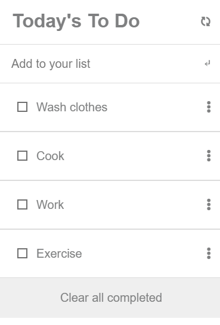

# to-do-list

> Web page to Showcase an Interactive To-do List as Microverse Project.

## Live Demo
[Online Version]()

## Getting Started

**This is an example of how you may give instructions on setting up your project locally.**
**Modify this file to match your project, remove sections that don't apply. For example: delete the testing section if the currect project doesn't require testing.**

To get a local copy up and running follow these simple example steps.

### Prerequisites

### Setup

### Install

### Usage

### Run tests

### Deployment

## Built With

- HTML
- CSS
- Javascript

## Author

👤 **Onesis Olea**

- GitHub: [@2bleo](https://github.com/2bleO)
- Twitter: [@OleaOnesis](https://twitter.com/OleaOnesis)
- LinkedIn: [Onesis Olea](https://www.linkedin.com/in/onesis-olea)

## 🤝 Contributing

Contributions, issues, and feature requests are welcome!

Feel free to check the [issues page](../../issues/).

## Show your support

Give a ⭐️ if you like this project!

## Acknowledgments

* [GitHub](https://www.github.com)
* [Microverse](https://microverse.org)

## 📝 Licenses
